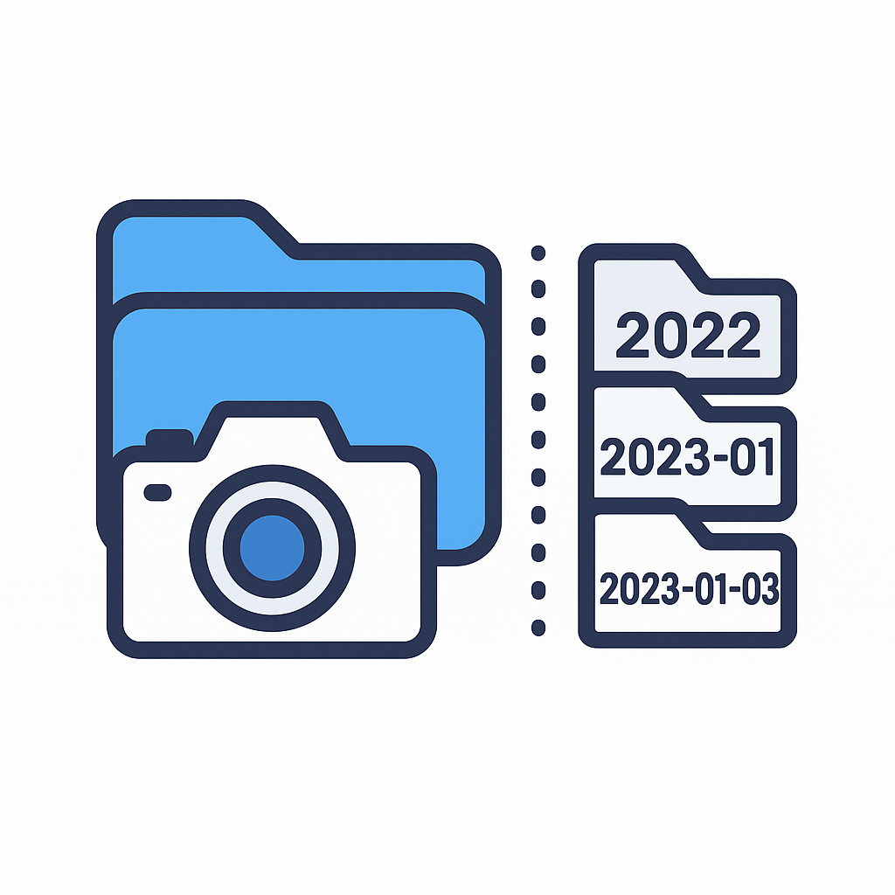

<p align="center">
  
</p>

# 📂 Photo Organizer Toolkit｜照片整理工具包

🧹 Automatically sort your photos by year, month, or day — with just one click.  
📸 支援 GUI 操作，讓爸媽也能輕鬆分類 1 萬張手機相簿！

[](LICENSE)
[](https://www.python.org/)
[](https://github.com/TengWei-Hung/PhotoOrganizer/releases)

---

## 🌐 語言版本 | Language Versions
- 🇬🇧 English & 🇹🇼 繁體中文說明（本頁）

---

❗初次執行可能會被防毒軟體警告，這是因為沒有數位簽章(代價約 100～500 USD/年），請放心使用，或將其加入信任清單。
⚠️When running this tool for the first time, your antivirus software may show a warning. This is because the executable is not digitally signed (code signing certificates cost around $100–$500 USD/year).
Please rest assured — the tool is safe to use, or you can add it to your antivirus whitelist.

---

## 🖱️ GUI 工具（適合一般使用者）| GUI Tool for Everyone
📦 [點我下載免安裝版本](https://github.com/TengWei-Hung/PhotoOrganizer/releases/download/v1.0.0/PhotoOrganizer_GUI_v1.0.zip)

### `photo_gui_launcher.exe`
如果你不會寫程式，只要雙擊這個執行檔就能開始使用。  
If you're not familiar with Python — just double-click to run!

✅ **無需安裝任何東西！已內建 Pillow 套件與 Python 執行環境。**  
✅ No installation required. This `.exe` includes Pillow and Python runtime.

📂 範例輸出 | Output example:
```
/Photos/
  ├── 2024/             ← 年分類 | Year mode
  ├── 2025-05/          ← 月分類 | Month mode
  ├── 2025-05-04/       ← 日分類 | Day mode
```

▶️ 使用方式 | How to Use:
1. 雙擊 `gui/photo_gui_launcher.exe`  
   📁 You can find this file in the `gui/` folder.
Double-click `gui/photo_gui_launcher.exe`
2. 選擇照片資料夾  
   Select your photo folder
3. 選擇分類方式（年/月/日）  
   Choose sort mode: Year / Month / Day
4. 點擊「Start Organizing」並等待完成  
   Click **Start Organizing** and wait

✨ 注意事項 | Notes:
- 支援副檔名：`.jpg`, `.jpeg`, `.png`, `.heic`, `.mov`, `.mp4`  
  Supports `.jpg`, `.jpeg`, `.png`, `.heic`, `.mov`, `.mp4`
- 若照片無 EXIF 資訊，將以檔案建立時間分類  
  Fallback to file creation time if EXIF missing
- 重複檔名會自動重新命名避免覆蓋  
  Duplicate file names will be safely renamed

---

## 🔧 安裝需求（僅限使用 .py 腳本者）| Requirements (for Python script users only)

使用 Python 腳本前，請先安裝 Pillow 套件：  
Install Pillow if you're using the raw `.py` scripts:

```bash
pip install Pillow
```

---

## 📁 開發者專用腳本 | Scripts for Developers

這些是適合進階使用者或軟體工程師的命令列工具。  
These are command-line tools for developers or advanced users.

### 1. `scripts/organize_photo_by_year.py`  
依年份分類照片，如 `2020/`, `2021/`  
Sort photos into folders like `2020/`, `2021/`

### 2. `scripts/organize_photo_by_month.py`  
從單一資料夾中依年月 `YYYY-MM/` 分類  
Group flat-folder photos by `YYYY-MM/`

### 3. `scripts/organize_photo_by_date.py`  
每日分類至 `YYYY-MM-DD/`（資料夾較多）  
Sort into daily folders `YYYY-MM-DD/`

### 4. `scripts/organize_photo_by_month_from_date.py`  
將多個日期資料夾（如 `2023-04-01/`）彙整為 `YYYY-MM/`  
Scan `YYYY-MM-DD/` folders and regroup into `YYYY-MM/`

每支腳本請修改這一行 | Set this line:
```python
source_folder = r"D:\Your\Folder\Path"
```

執行方式 | Run:
```bash
python script_name.py
```

---

## 📌 備註 | Notes

- 所有工具支援 `.jpg`, `.jpeg`, `.png`, `.heic`, `.mov`, `.mp4`
- 若照片無 EXIF 資訊，會使用檔案建立時間分類
- 自動避開檔名覆蓋，重複會自動重新命名

---

## ✅ 授權 | License

本專案使用 MIT 授權，歡迎自由使用與修改。  
This project is open source under the MIT License.
